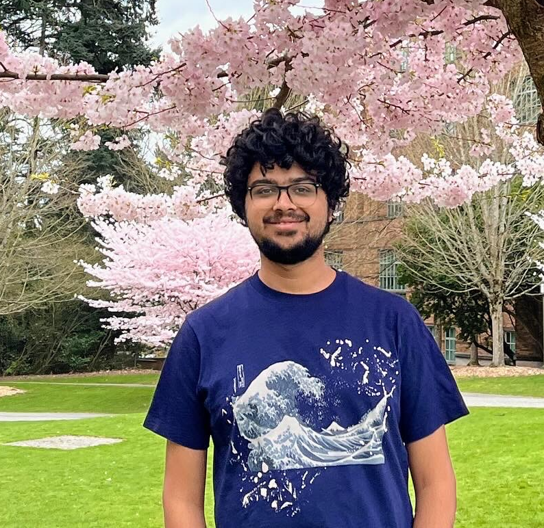

Hi! I am Kabir, a first year 🐣 PhD student at Paul G. Allen School of Computer Science, University of Washington (UW), where I am fortunate to be advised by <a href="https://homes.cs.washington.edu/~yuliats/">Prof. Yulia Tsvetkov</a>. Before joining UW, I spent two wonderful years at Microsoft Research India as a Pre-doctoral Research Fellow, where I worked with <a href="https://www.microsoft.com/en-us/research/people/susitara/"> Dr. Sunayana Sitaram</a>, <a href="https://www.microsoft.com/en-us/research/people/monojitc/"> Dr. Monojit Choudhury</a>, and <a href="https://www.microsoft.com/en-us/research/people/navingo/"> Dr. Navin Goyal</a>. For what feels like eons ago now, I did my undergraduate studies at BITS Pilani, India, where I graduated with a B.E (hons.) in Chemical Engineering (story 🍿 for some other day).

## Research Interests

I am broadly interested in Natural Language Processing (NLP), mainly towards understanding and improving the capabilities of language models. Some specific areas that I am currently working on or have looked at in the past include:

**🔭 Science of Language Models.** I am fascinated towards gaining an in-depth understanding of how language models work, their capabilities, and limitations. Some of my work in this space has included studying inductive biases that influence hierarchical generalization in transformers ([preprint](https://arxiv.org/abs/2404.16367)), understanding in-context learning through a Bayesian perspective ([ICLR 2024](https://arxiv.org/abs/2306.04891)), and analyzing capabilities and limitations of transformers and RNNs by studying them on Formal languages ([EMNLP 2020](https://aclanthology.org/2020.emnlp-main.576/), [COLING 2020](https://arxiv.org/abs/2011.03965)).

**🌎 Multilingual NLP.** How can we build linguistically fair NLP models that can serve a wide range of languages of the world including low-resource languages and dialects with little to no available data? In my past work I have looked at benchmarking propriety LLMs on 70 typologically diverse languages on multiple NLP datasets ([EMNLP 2023](https://arxiv.org/abs/2303.12528)) highlighting the limitations of current models in multilingual settings, studying cost-performance trade-offs of training multilingual models with different sources and qualities of data ([NAACL 2022](https://arxiv.org/abs/2205.06350)), and studying cross lingual transfer in pre-trained multilingual models ([ACL 2022](https://arxiv.org/abs/2205.06130), [EMNLP 2022](https://arxiv.org/abs/2210.12265)).

For a full list of my publications you can have a look [here](/publications.html).  Please feel free to reach out to me over  [email](mailto:kahuja@cs.washington.edu) if you have any questions about my research.

## News



- **{{ item.date }}**: {{ item.title }} - {{ item.description }}

- **{{ item.date }}**: {{ item.title }}



## Teaching
**Courses**
- TA'd for the Natural Language Processing class by Dr. Monojit Choudhury at Plaksha University for their [Tech Leaders Fellowship (TLF)](https://plaksha.edu.in/pg/tech-leaders-fellowship/) program in 2022 and 2023. Assignments and labs are available [here](https://github.com/kabirahuja2431/PlakshaNLP2023/tree/main).

**Talks and Tutorials**
- Tutorial on [Everything you need to know about Multilingual LLMs: 
Towards fair, performant and reliable models for languages of the world](https://aclanthology.org/2023.acl-tutorials.3/) at **ACL 2023**. Tutorial slides available [here](https://www.microsoft.com/en-us/research/uploads/prod/2023/07/ACL2023MultilingualModelsTutorial.pdf).

- Talk on multilingual evaluation of large language models for the Microsoft Africa Research Institute's research seminar . Recording available [here](https://www.microsoft.com/en-us/research/video/multilingual-evaluation-of-generative-ai-mega/).

I am also happy providing mentorship to students looking to start their research journey in NLP. Feel free to reach out to me over my [email](mailto:kahuja@cs.washington.edu).

<!-- ## Publications

1. F.Bar, J.Doe: Effects of having a placeholder of a name
2. S.Holmes, J.Watson: Consequences of living with a sociopath in London

## Typography

This is a [link](http://google.com). Something *italics* and something **bold**.

Here is a table

Year | Award | Category
-----|-------|--------
2014 | Emmy  | Won Outstanding Lead Actor in a miniseries or a movie
2015 | BAFTA | Nominated for Best Leading Actor for Sherlock
2014 | Satellite | Won Best Actor miniseries or television film

Here is a horizontal rule

---

Here is a blockquote

> To a great mind, nothing is little

## References

* Foo Bar: Head of Department, Placeholder Names, Lorem
* John Doe: Associate Professor, Department of Computer Science, Ipsum -->
